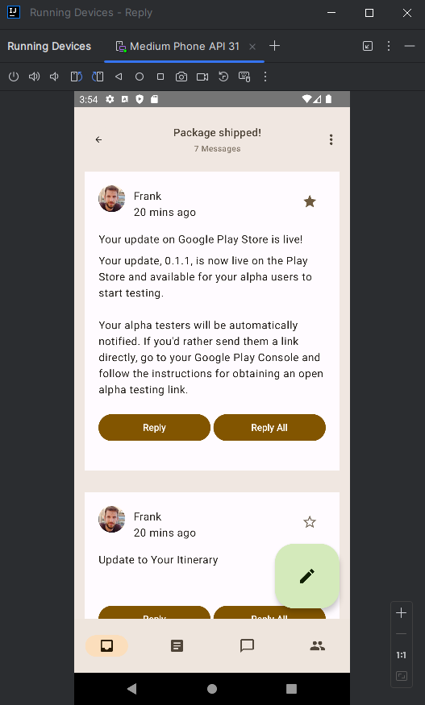

# Pacheco Cruz Eduardo | 6NM61 |

# Temas en Compose con Material 3

### 1. Copiar el repositorio:

El primer paso es clonar el repositorio con git:
Este repositorio contiene todos los codigos de ejemplo de la documentacion de Material 3.


### 2. Abrir el proyecto en IntelliJ IDEA:

Abrimos el proyecto "ThemingCodelab" en IntelliJ IDEA:


### 3. Esquemas de colores:

Seguimos el codelab de la documentacion de Material 3 para aprender a usar los temas en Compose. En el siguiente link:
[Documentacion de Material 3](https://developer.android.com/codelabs/jetpack-compose-theming?hl=es-419&continue=https%3A%2F%2Fdeveloper.android.com%2Fcourses%2Fpathways%2Fjetpack-compose-for-android-developers-2%3Fhl%3Des-419%23codelab-https%3A%2F%2Fdeveloper.android.com%2Fcodelabs%2Fjetpack-compose-theming#0)

En el proyecto se encuentra el archivo "Color.kt" en la carpeta "ui/theme". En este archivo se definen los colores del tema.

```kotlin
package com.example.reply.ui.theme

import androidx.compose.ui.graphics.Color

val Purple80 = Color(0xFFD0BCFF)
val PurpleGrey80 = Color(0xFFCCC2DC)
val Pink80 = Color(0xFFEFB8C8)

val Purple40 = Color(0xFF6650a4)
val PurpleGrey40 = Color(0xFF625b71)
val Pink40 = Color(0xFF7D5260)
```

En el archivo "Theme.kt" se definen los temas de la aplicacion y los esquemas de colores claro y oscuro. También contiene la función de componibilidad de temas principal, AppTheme().

```kotlin
package com.example.reply.ui.theme

import androidx.compose.material3.MaterialTheme
import androidx.compose.material3.darkColorScheme
import androidx.compose.material3.lightColorScheme
import androidx.compose.runtime.Composable

// Material 3 color schemes
private val DarkColorScheme = darkColorScheme(
    primary = Purple80,
    secondary = PurpleGrey80,
    tertiary = Pink80
)

private val LightColorScheme = lightColorScheme(
    primary = Purple40,
    secondary = PurpleGrey40,
    tertiary = Pink40

)

@Composable
fun ReplyTheme(
    darkTheme: Boolean = false,
    content: @Composable () -> Unit
) {
    val replyColorScheme = when {
        darkTheme -> DarkColorScheme
        else -> LightColorScheme
    }
    MaterialTheme(
        colorScheme = replyColorScheme,
        content = content
    )
}
```

### 4. Ejecutar la aplicacion:

Nuestra aplicacion se ve de la siguiente manera:


### 5. Cambiar el tema de la aplicacion:

Cambiamos el tema de la aplicacion en los archivos "MainActivity.kt", "Color.kt" y "Theme.kt".

**Color.kt**

```kotlin
package com.example.reply.ui.theme
import androidx.compose.ui.graphics.Color

val md_theme_light_primary = Color(0xFF825500)
val md_theme_light_onPrimary = Color(0xFFFFFFFF)
val md_theme_light_primaryContainer = Color(0xFFFFDDB3)
val md_theme_light_onPrimaryContainer = Color(0xFF291800)
val md_theme_light_secondary = Color(0xFF6F5B40)
val md_theme_light_onSecondary = Color(0xFFFFFFFF)
val md_theme_light_secondaryContainer = Color(0xFFFBDEBC)
val md_theme_light_onSecondaryContainer = Color(0xFF271904)
val md_theme_light_tertiary = Color(0xFF51643F)
val md_theme_light_onTertiary = Color(0xFFFFFFFF)
val md_theme_light_tertiaryContainer = Color(0xFFD4EABB)
val md_theme_light_onTertiaryContainer = Color(0xFF102004)
val md_theme_light_error = Color(0xFFBA1A1A)
val md_theme_light_errorContainer = Color(0xFFFFDAD6)
val md_theme_light_onError = Color(0xFFFFFFFF)
val md_theme_light_onErrorContainer = Color(0xFF410002)
val md_theme_light_background = Color(0xFFFFFBFF)
val md_theme_light_onBackground = Color(0xFF1F1B16)
val md_theme_light_surface = Color(0xFFFFFBFF)
val md_theme_light_onSurface = Color(0xFF1F1B16)
val md_theme_light_surfaceVariant = Color(0xFFF0E0CF)
val md_theme_light_onSurfaceVariant = Color(0xFF4F4539)
val md_theme_light_outline = Color(0xFF817567)
val md_theme_light_inverseOnSurface = Color(0xFFF9EFE7)
val md_theme_light_inverseSurface = Color(0xFF34302A)
val md_theme_light_inversePrimary = Color(0xFFFFB951)
val md_theme_light_shadow = Color(0xFF000000)
val md_theme_light_surfaceTint = Color(0xFF825500)
val md_theme_light_outlineVariant = Color(0xFFD3C4B4)
val md_theme_light_scrim = Color(0xFF000000)

val md_theme_dark_primary = Color(0xFFFFB951)
val md_theme_dark_onPrimary = Color(0xFF452B00)
val md_theme_dark_primaryContainer = Color(0xFF633F00)
val md_theme_dark_onPrimaryContainer = Color(0xFFFFDDB3)
val md_theme_dark_secondary = Color(0xFFDDC2A1)
val md_theme_dark_onSecondary = Color(0xFF3E2D16)
val md_theme_dark_secondaryContainer = Color(0xFF56442A)
val md_theme_dark_onSecondaryContainer = Color(0xFFFBDEBC)
val md_theme_dark_tertiary = Color(0xFFB8CEA1)
val md_theme_dark_onTertiary = Color(0xFF243515)
val md_theme_dark_tertiaryContainer = Color(0xFF3A4C2A)
val md_theme_dark_onTertiaryContainer = Color(0xFFD4EABB)
val md_theme_dark_error = Color(0xFFFFB4AB)
val md_theme_dark_errorContainer = Color(0xFF93000A)
val md_theme_dark_onError = Color(0xFF690005)
val md_theme_dark_onErrorContainer = Color(0xFFFFDAD6)
val md_theme_dark_background = Color(0xFF1F1B16)
val md_theme_dark_onBackground = Color(0xFFEAE1D9)
val md_theme_dark_surface = Color(0xFF1F1B16)
val md_theme_dark_onSurface = Color(0xFFEAE1D9)
val md_theme_dark_surfaceVariant = Color(0xFF4F4539)
val md_theme_dark_onSurfaceVariant = Color(0xFFD3C4B4)
val md_theme_dark_outline = Color(0xFF9C8F80)
val md_theme_dark_inverseOnSurface = Color(0xFF1F1B16)
val md_theme_dark_inverseSurface = Color(0xFFEAE1D9)
val md_theme_dark_inversePrimary = Color(0xFF825500)
val md_theme_dark_shadow = Color(0xFF000000)
val md_theme_dark_surfaceTint = Color(0xFFFFB951)
val md_theme_dark_outlineVariant = Color(0xFF4F4539)
val md_theme_dark_scrim = Color(0xFF000000)

val seed = Color(0xFF825500)
```

**Theme.kt**

```kotlin
package com.example.reply.ui.theme

import androidx.compose.foundation.isSystemInDarkTheme
import androidx.compose.material3.MaterialTheme
import androidx.compose.material3.darkColorScheme
import androidx.compose.material3.lightColorScheme
import androidx.compose.runtime.Composable

// Material 3 color schemes
private val LightColors = lightColorScheme(
    primary = md_theme_light_primary,
    onPrimary = md_theme_light_onPrimary,
    primaryContainer = md_theme_light_primaryContainer,
    onPrimaryContainer = md_theme_light_onPrimaryContainer,
    secondary = md_theme_light_secondary,
    onSecondary = md_theme_light_onSecondary,
    secondaryContainer = md_theme_light_secondaryContainer,
    onSecondaryContainer = md_theme_light_onSecondaryContainer,
    tertiary = md_theme_light_tertiary,
    onTertiary = md_theme_light_onTertiary,
    tertiaryContainer = md_theme_light_tertiaryContainer,
    onTertiaryContainer = md_theme_light_onTertiaryContainer,
    error = md_theme_light_error,
    errorContainer = md_theme_light_errorContainer,
    onError = md_theme_light_onError,
    onErrorContainer = md_theme_light_onErrorContainer,
    background = md_theme_light_background,
    onBackground = md_theme_light_onBackground,
    surface = md_theme_light_surface,
    onSurface = md_theme_light_onSurface,
    surfaceVariant = md_theme_light_surfaceVariant,
    onSurfaceVariant = md_theme_light_onSurfaceVariant,
    outline = md_theme_light_outline,
    inverseOnSurface = md_theme_light_inverseOnSurface,
    inverseSurface = md_theme_light_inverseSurface,
    inversePrimary = md_theme_light_inversePrimary,
    surfaceTint = md_theme_light_surfaceTint,
    outlineVariant = md_theme_light_outlineVariant,
    scrim = md_theme_light_scrim,
)

private val DarkColors = darkColorScheme(
    primary = md_theme_dark_primary,
    onPrimary = md_theme_dark_onPrimary,
    primaryContainer = md_theme_dark_primaryContainer,
    onPrimaryContainer = md_theme_dark_onPrimaryContainer,
    secondary = md_theme_dark_secondary,
    onSecondary = md_theme_dark_onSecondary,
    secondaryContainer = md_theme_dark_secondaryContainer,
    onSecondaryContainer = md_theme_dark_onSecondaryContainer,
    tertiary = md_theme_dark_tertiary,
    onTertiary = md_theme_dark_onTertiary,
    tertiaryContainer = md_theme_dark_tertiaryContainer,
    onTertiaryContainer = md_theme_dark_onTertiaryContainer,
    error = md_theme_dark_error,
    errorContainer = md_theme_dark_errorContainer,
    onError = md_theme_dark_onError,
    onErrorContainer = md_theme_dark_onErrorContainer,
    background = md_theme_dark_background,
    onBackground = md_theme_dark_onBackground,
    surface = md_theme_dark_surface,
    onSurface = md_theme_dark_onSurface,
    surfaceVariant = md_theme_dark_surfaceVariant,
    onSurfaceVariant = md_theme_dark_onSurfaceVariant,
    outline = md_theme_dark_outline,
    inverseOnSurface = md_theme_dark_inverseOnSurface,
    inverseSurface = md_theme_dark_inverseSurface,
    inversePrimary = md_theme_dark_inversePrimary,
    surfaceTint = md_theme_dark_surfaceTint,
    outlineVariant = md_theme_dark_outlineVariant,
    scrim = md_theme_dark_scrim,
)

@Composable
fun AppTheme(
    useDarkTheme: Boolean = isSystemInDarkTheme(),
    content: @Composable() () -> Unit
) {
    val colors = if (!useDarkTheme) {
        LightColors
    } else {
        DarkColors
    }

    MaterialTheme(
        colorScheme = colors,
        content = content
    )
}
```

**MainActivity.kt**

```kotlin
setContent {
            val uiState by viewModel.uiState.collectAsState()

            AppTheme {
                ReplyApp(
                replyHomeUIState = uiState,
                closeDetailScreen = {
                    viewModel.closeDetailScreen()
                },
                navigateToDetail = { emailId ->
                    viewModel.setSelectedEmail(emailId)
                }
            ) }
        }
```

**MainActivity.kt**

```kotlin
@Preview(
    uiMode = UI_MODE_NIGHT_YES,
    name = "DefaultPreviewDark"
)
@Preview(
    uiMode = UI_MODE_NIGHT_NO,
    name = "DefaultPreviewLight"
)
@Composable
fun ReplyAppPreviewLight() {
    AppTheme {
        ReplyApp(
            replyHomeUIState = ReplyHomeUIState(
                emails = LocalEmailsDataProvider.allEmails
            )
        )
    }
}
```

Si ejecutamos la aplicacion, se vera de la siguiente manera:


Si cambiamos el tema del celular a oscuro, se vera de la siguiente manera:


### 6. Agregar colores conforme a su rol y uso:

**Colores de superficie**
En la pantalla principal, comenzarás uniendo el elemento componible principal de la app en una función Surface() para proporcionar la base para que el contenido de la app se coloque encima. Abre MainActivity.kt y une el elemento componible ReplyApp() con Surface.

**MainActivity.kt**

```kotlin
import androidx.compose.ui.unit.dp

AppTheme {
   Surface(tonalElevation = 5.dp) {
       ReplyApp(
           replyHomeUIState = uiState,
          // Resto del código
         )
   }
}
```

Ahora la aplicacion se ve de la siguiente manera:


**Colores de la barra de la aplicación**

Para cambiar el color de la barra de la aplicación, debemos agregar el siguiente código en el archivo "ui/components/ReplyAppBars.kt".

Agregaremos MaterialTheme.colorScheme.background al Modifier del elemento componible Row.

```kotlin
@Composable
fun ReplySearchBar(modifier: Modifier = Modifier) {
   Row(
       modifier = modifier
           .fillMaxWidth()
           .padding(16.dp)
           .background(MaterialTheme.colorScheme.background),
       verticalAlignment = Alignment.CenterVertically
   ) {
       // Resto del código
   }
}
```

Ahora la aplicacion se ve de la siguiente manera:


**Colores del botón de acción flotante**

Actualizaremos el siguiente archivo "ReplyListContent.kt"

```kotlin
import androidx.compose.material3.MaterialTheme

ReplyInboxScreen(/*..*/) {
// Email list content
  LargeFloatingActionButton(
    containerColor = MaterialTheme.colorScheme.tertiaryContainer,
    contentColor = MaterialTheme.colorScheme.onTertiaryContainer
  ){
   /*..*/
  }
}
```

**Colores de tarjetas**

Actualizaremos el archivo "ui/components/ReplyEmailListItem.kt"
actualizaremos el color del contenedor de la tarjeta con CardDefaults.cardColors() en los correos electrónicos importantes:

```kotlin
Card(
   modifier =  modifier
       .padding(horizontal = 16.dp, vertical = 4.dp)
       .semantics { selected = isSelected }
       .clickable { navigateToDetail(email.id) },
   colors = CardDefaults.cardColors(
       containerColor = if (email.isImportant)
           MaterialTheme.colorScheme.secondaryContainer
       else MaterialTheme.colorScheme.surfaceVariant
   )
){
  /*..*/
}
```

**Color del elemento de la lista de la página de detalles**

Por ultimo modificaremos el archivo "ReplyEmailThreadItem.kt"

```kotlin
@Composable
fun ReplyEmailThreadItem(
   email: Email,
   modifier: Modifier = Modifier
) {
   Column(
       modifier = modifier
           .fillMaxWidth()
           .padding(16.dp)
           .background(MaterialTheme.colorScheme.background)
           .padding(20.dp)
    ) {
      // List item content
    }
}
```

Nuestra aplicacion se vera de la siguiente manera ya con todos estos cambios aplicados:




### 7. Agregar colores dinámicos

Reemplaza el código de la función AppTheme en el archivo Theme.kt por el siguiente:

**Theme.kt**

```kotlin
@Composable
fun AppTheme(
   useDarkTheme: Boolean =  isSystemInDarkTheme(),
   content: @Composable () -> Unit
) {
   val context = LocalContext.current
   val colors = when {
       (Build.VERSION.SDK_INT >= Build.VERSION_CODES.S) -> {
           if (useDarkTheme) dynamicDarkColorScheme(context)
           else dynamicLightColorScheme(context)
       }
       useDarkTheme -> DarkColors
       else -> LightColors
   }

      MaterialTheme(
       colorScheme = colors,
       content = content
     )
}
```

La aplicación ahora se ve de la siguiente manera:


Tambien podemos cambiar el color de la barra de estado de la aplicacion:

**Theme.kt**

```kotlin
@Composable
fun AppTheme(
   useDarkTheme: Boolean =  isSystemInDarkTheme(),
   content: @Composable () -> Unit
) {

 // color scheme selection code

 // Add primary status bar color from chosen color scheme.
 val view = LocalView.current
 if (!view.isInEditMode) {
    SideEffect {
        val window = (view.context as Activity).window
        window.statusBarColor = colors.primary.toArgb()
        WindowCompat
            .getInsetsController(window, view)
            .isAppearanceLightStatusBars = useDarkTheme
    }
 }

  MaterialTheme(
    colorScheme = colors,
     content = content
   )
}
```


### 8. Tipografía

Usaremos los siguientes 5 estilos de tipografía la app: **headlineSmall**, **titleLarge**, **bodyLarge**, **bodyMedium** y **labelMedium**. Estos estilos cubrirán la pantalla principal y la pantalla de detalles. Abriremos "ui/theme/type.kt".

**Type.kt**

```kotlin
val typography = Typography(
   headlineSmall = TextStyle(
       fontWeight = FontWeight.SemiBold,
       fontSize = 24.sp,
       lineHeight = 32.sp,
       letterSpacing = 0.sp
   ),
   titleLarge = TextStyle(
       fontWeight = FontWeight.Normal,
       fontSize = 18.sp,
       lineHeight = 28.sp,
       letterSpacing = 0.sp
   ),
   bodyLarge = TextStyle(
       fontWeight = FontWeight.Normal,
       fontSize = 16.sp,
       lineHeight = 24.sp,
       letterSpacing = 0.15.sp
   ),
   bodyMedium = TextStyle(
       fontWeight = FontWeight.Medium,
       fontSize = 14.sp,
       lineHeight = 20.sp,
       letterSpacing = 0.25.sp
   ),
   labelMedium = TextStyle(
       fontWeight = FontWeight.SemiBold,
       fontSize = 12.sp,
       lineHeight = 16.sp,
       letterSpacing = 0.5.sp
   )
)
```

Ahora la agregaremos al tema, dentro de AppTheme.

**Theme.kt**

```kotlin
@Composable
fun AppTheme(
   useDarkTheme: Boolean = isSystemInDarkTheme(),
   content: @Composable() () -> Unit
) {
  // dynamic theming content

   MaterialTheme(
       colorScheme = colors,
       typography = typography,
       content = content
   )
}
```

**_Tipografía de lista de la pantalla principal_**

Aplicaremos la tipografía a la función ReplyEmailListItem en ui/components/ReplyEmailListItem.kt para crear una distinción entre títulos y etiquetas:

**ReplyEmailListItem.kt**

```kotlin
Text(
   text = email.sender.firstName,
   style = MaterialTheme.typography.labelMedium
)

Text(
   text = email.createdAt,
   style = MaterialTheme.typography.labelMedium
)

Text(
   text = email.subject,
   style = MaterialTheme.typography.titleLarge,
   modifier = Modifier.padding(top = 12.dp, bottom = 8.dp),
)

Text(
   text = email.body,
   maxLines = 2,
   style = MaterialTheme.typography.bodyLarge,
   overflow = TextOverflow.Ellipsis
)
```

**_Tipografía de lista de la página de detalles_**

De manera similar, agregarás la tipografía en la pantalla de detalles actualizando todos los elementos componibles de texto de ReplyEmailThreadItem en ui/components/ReplyEmailThreadItem.kt:

**ReplyEmailThreadItem.kt**

```kotlin
Text(
   text = email.sender.firstName,
   style = MaterialTheme.typography.labelMedium
)

Text(
   text = stringResource(id = R.string.twenty_mins_ago),
   style = MaterialTheme.typography.labelMedium
)

Text(
   text = email.subject,
   style = MaterialTheme.typography.bodyMedium,
   modifier = Modifier.padding(top = 12.dp, bottom = 8.dp),
)

Text(
   text = email.body,
   style = MaterialTheme.typography.bodyLarge,
   color = MaterialTheme.colorScheme.onSurfaceVariant
)
```

**_Personalización de la tipografía_**

Ahora Cambiarás el estilo de texto del archivo theme/Type.kt, que se reflejará en todos los componentes que lo usen.

Actualiza fontWeight a SemiBold y lineHeight a 32.sp para titleLarge, que se usa para el asunto en el elemento de lista. Esto pondrá más énfasis en el asunto y proporcionará separaciones claras.

**Type.kt**

```kotlin
titleLarge = TextStyle(
   fontWeight = FontWeight.SemiBold,
   fontSize = 18.sp,
   lineHeight = 32.sp,
   letterSpacing = 0.0.sp
),
```

La aplicación ahora se ve de la siguiente manera:


### 9. Formas

Crearemos el archivo "Shape.kt" en la carpeta "ui/theme" y definiremos las formas de la aplicación.

**Shape.kt**

```kotlin
package com.example.reply.ui.theme

import androidx.compose.foundation.shape.RoundedCornerShape
import androidx.compose.material3.Shapes
import androidx.compose.ui.unit.dp

val shapes = Shapes(
   extraSmall = RoundedCornerShape(4.dp),
   small = RoundedCornerShape(8.dp),
   medium = RoundedCornerShape(16.dp),
   large = RoundedCornerShape(24.dp),
   extraLarge = RoundedCornerShape(32.dp)
)
```

Ahora que definiste tus shapes, pásalas al elemento MaterialTheme de M3 como lo hiciste con los colores y la tipografía:

**Theme.kt**

```kotlin
@Composable
fun AppTheme(
   useDarkTheme: Boolean = isSystemInDarkTheme(),
   content: @Composable() () -> Unit
) {
  // dynamic theming content

   MaterialTheme(
       colorScheme = colors,
       typography = typography,
       shapes = shapes,
       content = content
   )
}
```

**_Forma de la barra de la aplicación_**

TopAppBar está usando un elemento Row con un color de fondo. Para lograr el fondo con esquinas redondeadas, define la forma del fondo pasando CircleShape al modificador del fondo:

**ReplyAppBars.kt**

```kotlin
@Composable
fun ReplySearchBar(modifier: Modifier = Modifier) {
   Row(
       modifier = modifier
           .fillMaxWidth()
           .padding(16.dp)
           .background(
               MaterialTheme.colorScheme.background,
               CircleShape
           ),
       verticalAlignment = Alignment.CenterVertically
   ) {
       // Search bar content
   }
}
```

**_Forma del elemento de lista de la página de detalles_**

**ReplyEmailThreadItem.kt**

```kotlin
@Composable
fun ReplyEmailThreadItem(
   email: Email,
   modifier: Modifier = Modifier
) {
   Column(
       modifier = modifier
           .fillMaxWidth()
           .padding(8.dp)
           .background(
               MaterialTheme.colorScheme.background,
               MaterialTheme.shapes.medium
           )
           .padding(16.dp)

   ) {
      // List item content

   }
}
```

La aplicación ahora se ve de la siguiente manera:


### 10. Énfasis

Actualiza ReplyEmailListItem.kt para ofrecer una diferencia de énfasis usando la variante de superficie. De forma predeterminada, el contenido de la tarjeta toma el color predeterminado según el fondo.

**ReplyEmailListItem.kt**

```kotlin
Text(
   text = email.createdAt,
   style = MaterialTheme.typography.labelMedium,
   color = MaterialTheme.colorScheme.onSurfaceVariant
)

Text(
   text = email.body,
   maxLines = 2,
   style = MaterialTheme.typography.bodyLarge,
   color = MaterialTheme.colorScheme.onSurfaceVariant,
   overflow = TextOverflow.Ellipsis
)
```

La aplicacion final se ve de la siguiente manera:


